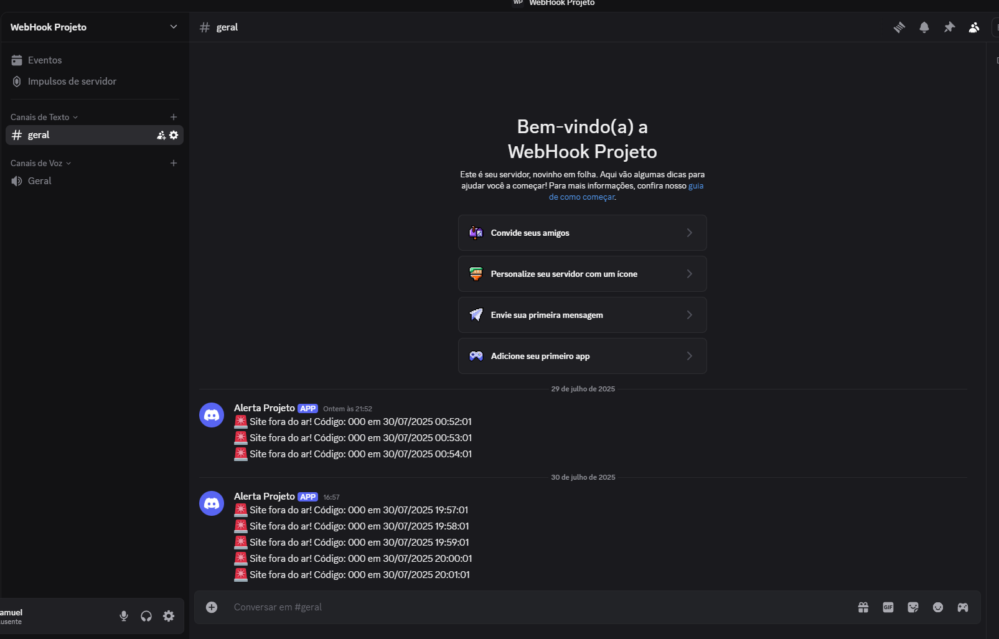

## Teste de Monitoramento e Notificação

Para verificar se o script de monitoramento está funcionando corretamente, realizamos a seguinte simulação:

- Paramos o serviço NGINX manualmente com:
```bash
sudo systemctl stop nginx
```
- Aguardamos 1 minuto para o cron executar o script.
- O script detectou a parada e enviou um alerta via webhook para o canal do Discord configurado.

## Resultado do Teste

A imagem abaixo mostra o alerta gerado automaticamente no Discord:



Esse alerta confirma que o monitoramento está funcionando corretamente e que a comunicação com o Discord está ativa.
